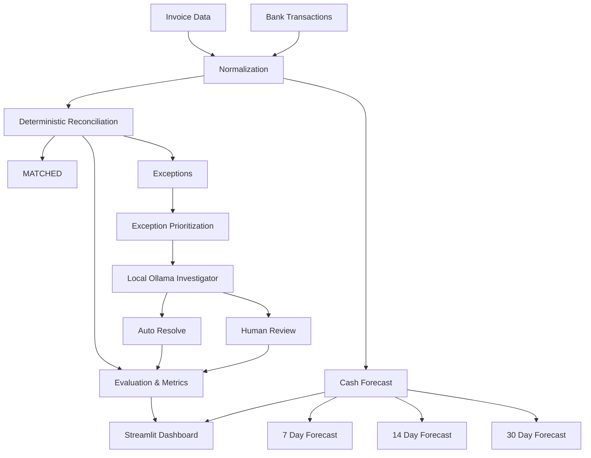

# AI Finance Controller

An intelligent financial reconciliation and cash-control system that combines deterministic financial matching, risk-based exception prioritization, local AI investigation, human review, evaluation metrics, and cash forecasting.

## Overview

Financial teams must reconcile invoices against bank transactions, determine whether payments are complete, and identify records that need operational attention. Common reconciliation problems include:

- amount mismatches
- split payments
- timing differences
- duplicate payments
- missing payments

The AI Finance Controller processes these cases in stages. It first normalizes the invoice and bank data, then applies deterministic reconciliation rules. Only selected uncertain exceptions are sent to the local AI investigator. High-confidence automation can be recorded separately, while low-confidence or failed investigations remain available for human review.

**Deterministic reconciliation remains the system of record. The AI layer augments exception investigation rather than replacing financial controls.**

The project is designed as a transparent buildathon and engineering demonstration: every major result is written to CSV, the baseline is evaluated against ground truth, and unresolved exceptions remain visible rather than being artificially resolved.

## Quick Start

### 1. Clone the repository

```bash
git clone https://github.com/arvi2006/AI-Finance-Controller.git
cd AI-Finance-Controller
```

### 2. Create a virtual environment

```bash
python -m venv .venv
```

### 3. Activate the virtual environment

For Windows:

```cmd
.venv\Scripts\activate
```

After activation, the terminal should show something similar to:

```text
(.venv) C:\Users\<username>\AI-Finance-Controller>
```

### 4. Install dependencies

```cmd
pip install -r requirements.txt
```

### 5. Run the complete application

```cmd
python run.py
```

This runs the seven pipeline stages in order and then launches the Streamlit dashboard. The AI investigation stage uses the local Ollama service when available; failed or unavailable AI investigations remain in human review.

### 6. Run automated tests

```cmd
pytest -v
```

The test suite uses deterministic fixtures and mocks Ollama requests, so normal test execution does not require Ollama.

### Optional launcher modes

Run the pipeline without starting Streamlit:

```cmd
python run.py --pipeline
```

Launch only the dashboard using the existing generated outputs:

```cmd
python run.py --app
```

Run the pipeline without the local AI resolver:

```cmd
python run.py --pipeline --skip-ai
```

## Architecture



## Project Structure

```text
AI-Finance-Controller/
├── app.py                              # Streamlit operations dashboard
├── requirements.txt                    # Runtime and test dependencies
├── pytest.ini                          # Pytest markers and test discovery
├── data/
│   └── generated/                      # Generated demo inputs and outputs
├── src/
│   ├── data_generator.py               # Deterministic synthetic data creation
│   ├── normalizer.py                   # Text, date, and amount normalization
│   ├── reconciliation/
│   │   ├── matcher.py                  # Primary deterministic matcher
│   │   ├── exceptions.py               # Exception filtering and summaries
│   │   └── scoring.py                  # Baseline evaluation and reports
│   ├── agent/
│   │   ├── investigator.py             # Local Ollama exception investigator
│   │   └── resolver.py                 # Capped AI-assisted exception handling
│   ├── evaluation/
│   │   ├── metrics.py                  # Invoice-aligned evaluation metrics
│   │   └── exception_prioritizer.py    # P0/P1/P2/P4 operational risk ranking
│   └── forecasting/
│       └── cash_forecast.py            # Deterministic cash-position forecast
└── tests/                              # Fast deterministic pytest suite
```

## Key Design Principles

### Deterministic-first controls

The matcher remains the primary reconciliation engine. It uses normalized customer descriptions, amount comparisons, date windows, confidence scoring, split-payment detection, and duplicate detection. The original deterministic `status` is preserved in AI-enhanced output.

### Bounded local AI

The resolver selects only genuinely ambiguous cases and limits AI investigations with a configurable maximum. It records the AI decision, confidence, reason, action, and elapsed time. Ollama failures, timeouts, invalid JSON, and connection errors become human-review outcomes without stopping the batch.

### Honest evaluation

Baseline and AI-assisted results are compared to ground truth by `invoice_id`, not by dataframe row order. The evaluation reports correct classifications, exceptions, accuracy, AI investigation counts, failures, latency, and final unresolved errors.

### Independent risk and AI signals

Exception priority is based on operational risk:

- `P0_CRITICAL`: system predicted `MATCHED`, but expected status is not `MATCHED`
- `P1_HIGH`: system status disagrees with expected status, excluding P0
- `P2_MEDIUM`: explicit review status or low deterministic confidence
- `P4_NORMAL`: remaining unresolved exception

AI investigation is tracked independently with the `ai_investigated` boolean. It does not create a separate risk priority or override a higher-risk classification.

## Data and Generated Outputs

The synthetic input data contains invoice records and bank transactions. The current generated files include 500 invoices, 564 bank transactions, and a 30-day forecast. Generated results are written under `data/generated/` and are useful for reproducing the demonstration.

| File | Purpose |
| --- | --- |
| `invoices.csv` | Synthetic invoice records |
| `bank_transactions.csv` | Synthetic bank payment transactions |
| `ground_truth.csv` | Expected reconciliation classifications |
| `reconciliation_results.csv` | Deterministic matcher output |
| `evaluation_results.csv` | Detailed baseline evaluation |
| `ai_reconciliation_results.csv` | Full AI-enhanced result set |
| `final_evaluation.csv` | Summary baseline and AI metrics |
| `exception_report.csv` | Unresolved evaluation exceptions |
| `prioritized_exceptions.csv` | Risk-ranked exception queue |
| `cash_forecast.csv` | Daily cash-position forecast |

## Installation

Python 3.13 is supported by the validated local environment. Create and activate a virtual environment, then install the dependencies:

```powershell
python -m venv .venv
.venv\Scripts\Activate.ps1
python -m pip install -r requirements.txt
```

The direct dependencies are:

- `pandas` for tabular processing
- `faker` for synthetic data generation
- `scikit-learn` for evaluation metrics
- `requests` for the local Ollama API integration
- `streamlit` for the dashboard
- `pytest` for automated tests

## Reproduce the Pipeline

Run the deterministic data and reconciliation stages first:

```powershell
python -m src.data_generator
python -m src.reconciliation.matcher
python -m src.reconciliation.scoring
```

Run the optional local AI exception stage:

```powershell
python -m src.agent.resolver
```

The resolver uses the local Ollama API at `http://localhost:11434/api/generate`. Ollama is not required for the deterministic pipeline or the automated test suite. When Ollama is unavailable, investigated cases safely remain in human review.

Generate evaluation and risk reports:

```powershell
python -m src.evaluation.metrics
python -m src.evaluation.exception_prioritizer
```

Generate the cash forecast:

```powershell
python -m src.forecasting.cash_forecast
```

The forecast uses observed transaction amounts as the current cash-receipts total. The input bank data contains positive payment/inflow transactions and is not a complete bank ledger. Forecast outflows use an explicitly labelled synthetic operating-expense assumption rather than fabricated historical expenses.

## Streamlit Dashboard

Start the dashboard with:

```powershell
streamlit run app.py
```

The dashboard provides six operational views:

1. **Executive Overview**: headline reconciliation, AI, exception, and cash KPIs
2. **Reconciliation**: searchable status and confidence view of deterministic results
3. **Exception Intelligence**: P0/P1/P2/P4 risk queue and critical exception detail
4. **AI Investigation**: investigation outcomes, confidence, actions, failures, and latency
5. **Cash Position**: projected closing cash and expected daily cash flows
6. **Human Review**: filtered queue for unresolved or escalated cases

Dashboard values are loaded dynamically from generated CSV files. The application joins related data by `invoice_id`, handles missing optional outputs with user-facing messages, and does not make Ollama calls.

## Automated Testing

Run the complete suite:

```powershell
pytest -v
```

The suite uses small deterministic fixtures and mocks Ollama HTTP requests. Normal test execution does not require Ollama and does not run the full 500-record AI resolver.

Available markers:

```powershell
pytest -v -m unit
pytest -v -m integration
pytest -v -m "not ollama"
pytest -v -m slow
```

Tests cover:

- synthetic data generation contracts
- text, date, and amount normalization
- deterministic matching and all supported reconciliation statuses
- accuracy, precision, recall, F1, and invoice-aligned joins
- investigator success and failure responses
- resolver caps, uniqueness, status preservation, and failure handling
- evaluation metrics and latency scoping
- exception priority and independent AI flags
- cash forecast roll-forward, timing, summaries, and empty inputs
- end-to-end pipeline integrity

## Operational Metrics

The evaluation layer reports:

- records processed
- baseline correct classifications and exceptions
- baseline accuracy
- AI investigations and non-investigated records
- AI auto-resolutions and human-review cases
- AI failures and timeouts
- AI-assisted correct classifications and exceptions
- AI-assisted accuracy and accuracy change
- average investigated-case latency and total AI time
- final unresolved errors

Metrics are calculated from the generated CSV outputs. They are not hard-coded into the dashboard or README.

## Limitations

- The dataset is synthetic and intended for demonstration and testing.
- The bank transaction input is not a complete general-ledger or bank ledger; it contains payment/inflow records and does not model all expenses or opening balances.
- Cash outflows are forecast using a configurable synthetic daily operating-expense assumption.
- Local AI performance depends on the installed Ollama model and available hardware.
- AI investigation is intentionally bounded and is not a replacement for financial approval controls.

## Security and Repository Hygiene

Local secrets, virtual environments, Python bytecode, test caches, logs, and temporary machine files are excluded through `.gitignore`. Generated CSV outputs are retained because they are required to demonstrate the reconciliation, evaluation, prioritization, and forecasting workflow.

## License

This project is licensed under the MIT License.

See the [LICENSE](LICENSE) file for the full license text.